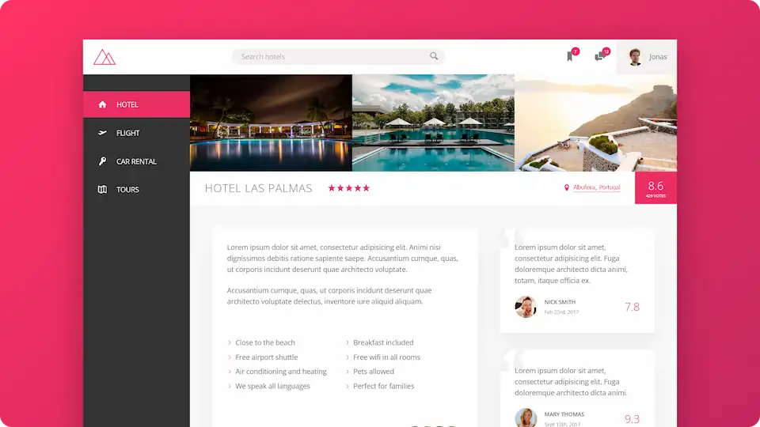

#  Trillo

**Demo hotel booking service.**

## 💻 Screenshot

## 🛠️ Tools and technologies
`Sass` `SCSS` `HTML` `VS Code`

## 🌐 Deployment
Deployed on `Netlify`.

Live preview at [dawidlehai-trillo.netlify.app](https://dawidlehai-trillo.netlify.app/).

## 🎓 Related course
This project was created as a part of the [Udemy](https://www.udemy.com/ 'Udemy') course [_Advanced CSS and Sass: Flexbox, Grid, Animations and More!_](https://www.udemy.com/course/advanced-css-and-sass/ 'See this course on Udemy') by [Jonas Schmedtmann](https://twitter.com/jonasschmedtman 'Jonas Schmedtmann on Twitter').

By preparing this project I learned **advanced flexbox**.
